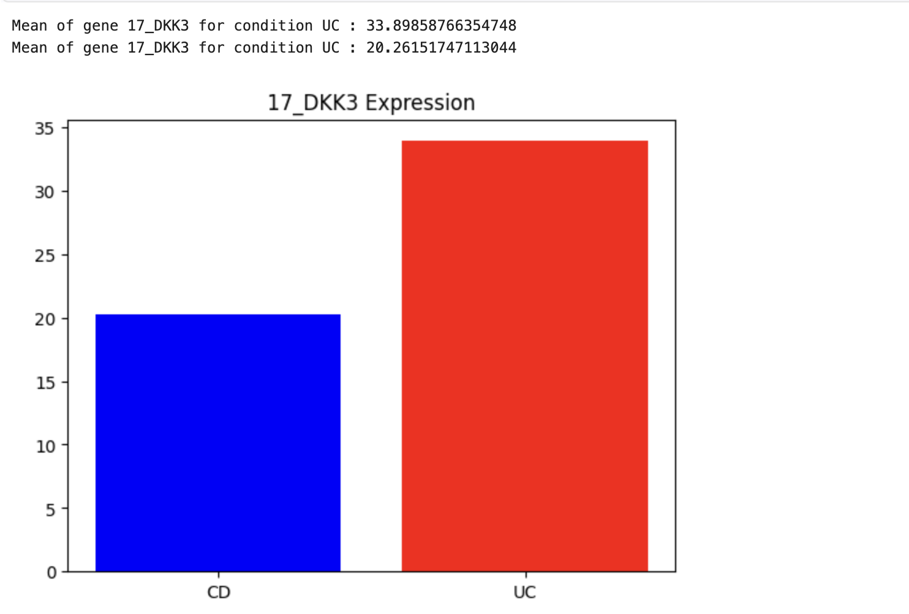

# UC vs Crohns Differential Gene Expression

This repository is in its initial phase and is currently under development.

This repository presents a bioinformatics project focused on differential gene expression analysis between Ulcerative Colitis and Crohn’s Disease using the GEO dataset GSE235236

## Data Cleaning

1. Basic string processing was performed to clean and standardize column names.
1. Counts Per Million (CPM) normalization was applied to account for differences in sequencing depth across samples.
1. Genes were filtered based on CPM values, retaining only those with expression levels greater than 10.

## Kolmogorov-Smirnov Test (KS)

KS test is not commonly used in differential gene expression analysis because it does not specifically target mean differences, which are usually of biological interest. However, it is useful in a beginner setting because it is simple to implement and does not require strong assumptions.

In this project, KS test compares the distribution of gene expression values across samples (26 UC vs 22 CD) and identifies genes whose expression patterns differ between conditions.

It can detect differences beyond just the mean, such as variability, skewness, or subpopulation effects. However, for typical differential expression tasks where consistent up/down regulation is the goal, methods like DESeq2 are more appropriate and statistically powerful.

## Log2Fold

log2fold tells us the differenece between gene expression across the condition. 

It exactly tells us how expression changes between conditions

- +1 means 2 times more expressed in one condtion 
- +2 means 4 times more expressed in one condtion 
- -1 means 2 times less expressed in one condtion 
- -2 means 4 times less expressed in one condtion 

This gives a very good intuition to judge the genes 

## Applying Benjamini–Hochberg correction

As we are testing tens of thounsands of samples by chance there will be alot of false negetives. To remove these false negetives we apply Benjamini-Hochberg Correction

## Applying filter
Keeping where genes are unlikely to be random chance p_value_bonf <=0.05
 Keeping Genes where expression is large log_FC > 0.25

## Gene Identified

ENSG00000050165.17_DKK3
Mean of gene 17_DKK3 for condition UC : 33.89858766354748
Mean of gene 17_DKK3 for condition UC : 20.26151747113044

